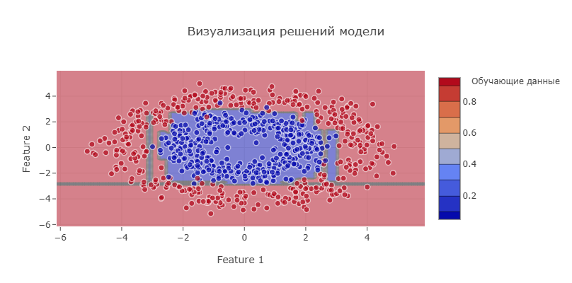

# AlgoView

AlgoView - это образовательный проект для изучения алгоритмов машинного обучения с нуля. Проект включает реализации популярных алгоритмов классификации, их визуализацию и веб-интерфейс для интерактивного взаимодействия.



## Компоненты проекта

### 1. Библиотека алгоритмов (algoview)
Реализации алгоритмов машинного обучения с подробными комментариями и визуализацией.

### 2. Веб-приложение (algoview-web)
Интерактивный веб-интерфейс для визуализации работы алгоритмов в задаче кредитного скоринга.

#### Особенности веб-приложения:
- 🎯 Интерактивная визуализация алгоритмов
- 📊 Работа с реальным набором данных UCI Credit Card
- 🔍 Расчет и отображение метрик качества
- 💡 Наглядное представление процесса принятия решений

## Реализованные алгоритмы

### Базовые алгоритмы
- Линейные модели
  - Логистическая регрессия
  - Линейный дискриминантный анализ (LDA)
- Деревья решений
  - Классификатор на основе дерева решений
  - Регрессор на основе дерева решений
- Вероятностные модели
  - Наивный байесовский классификатор (Gaussian NB)
- Методы ближайших соседей
  - K-ближайших соседей (KNN)

### Ансамблевые методы
- Бэггинг
  - Случайный лес (Random Forest)
  - Баггинг классификатор
- Бустинг
  - Градиентный бустинг (GBM)
- Стекинг
  - Стекинг ансамбль

## Визуализация

Каждый алгоритм сопровождается визуализатором, который помогает понять:
- Процесс принятия решений
- Границы классификации
- Внутреннее устройство модели
- Распределение данных и их особенности

## Установка и запуск

### Установка библиотеки
```bash
git clone https://github.com/iRatG/AlgoView.git
cd AlgoView
pip install -r requirements.txt
```

### Запуск веб-приложения
```bash
cd algoview-web
python run.py
```

В Windows используйте следующие команды:
```powershell
cd algoview-web
python run.py
```

### Важные заметки

1. **Набор данных**: Убедитесь, что файл `UCI_Credit_Card.csv` находится в папке `algoview-web/data/`. Его можно скачать с [UCI Machine Learning Repository](https://archive.ics.uci.edu/ml/datasets/default+of+credit+card+clients).

2. **Зависимости**: 
   - Python 3.8 или выше
   - Flask (веб-сервер)
   - NumPy, Pandas (обработка данных)
   - Scikit-learn (алгоритмы ML)
   - Plotly (визуализация)

3. **Troubleshooting**: 
   - При проблемах с установкой зависимостей используйте виртуальное окружение:
     ```bash
     python -m venv venv
     source venv/bin/activate  # для Linux/Mac
     venv\Scripts\activate     # для Windows
     pip install -r requirements.txt
     ```

## Использование

### Пример анализа данных о кредитных картах

```python
from algoview.examples.credit_card_analysis import CreditCardAnalyzer

# Создаем анализатор
analyzer = CreditCardAnalyzer()

# Визуализируем работу всех алгоритмов
analyzer.visualize_all()
```

### Использование отдельных алгоритмов

```python
from algoview.base_algorithms.linear.logistic import LogisticRegression
from algoview.visualization.logistic_viz import LogisticRegressionVisualizer

# Создаем и обучаем модель
model = LogisticRegression()
model.fit(X_train, y_train)

# Визуализируем процесс обучения и принятия решений
visualizer = LogisticRegressionVisualizer()
visualizer.visualize()
```

## Структура проекта

```
algoview/
├── base_algorithms/
│   ├── linear/ (LogisticRegression, LDA)
│   ├── trees/ (DecisionTree, DecisionTreeRegressor)
│   ├── probabilistic/ (GaussianNB)
│   └── neighbors/ (KNN)
├── ensemble/
│   ├── bagging.py (RandomForest, BaggingClassifier)
│   ├── boosting.py (GBMClassifier)
│   └── stacking.py (StackingEnsemble)
├── metrics/
├── utils/
└── visualization/
```

## Требования

- Python 3.8+
- NumPy
- Pandas
- Matplotlib
- Scikit-learn (только для сравнения результатов)
- Seaborn (для визуализации)

## Лицензия

MIT License

## Авторы

- [iRatG](https://github.com/iRatG)

## Вклад в проект

Мы приветствуем вклад в развитие проекта! Если вы хотите добавить новый алгоритм, улучшить визуализацию или исправить ошибку:

1. Форкните репозиторий
2. Создайте ветку для ваших изменений
3. Внесите изменения и создайте pull request

## Цитирование

Если вы используете этот проект в своих исследованиях или обучении, пожалуйста, ссылайтесь на него:

```bibtex
@misc{algoview2024,
  author = {iRatG},
  title = {AlgoView: Educational Machine Learning Algorithms Visualization},
  year = {2024},
  publisher = {GitHub},
  url = {https://github.com/iRatG/AlgoView}
}
``` 